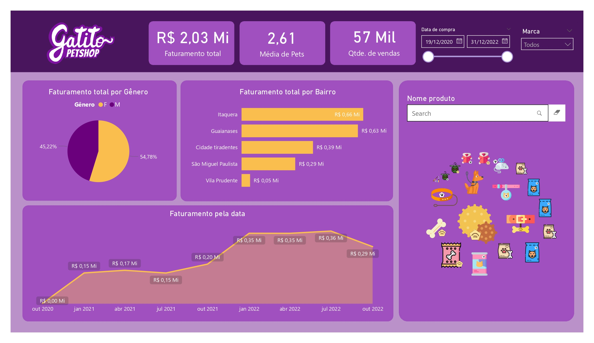

# 🚀 Primeiro Projeto de Business Intelligence: Dashboard para Gatitos Pet Shop 🐾

Após concluir o meu **primeiro curso de Business Intelligence**, mergulhei de cabeça no Power BI para aplicar o que aprendi em um projeto prático: a criação de um **Dashboard interativo para a Gatitos Pet Shop**. O objetivo? Transformar dados de vendas e desempenho da loja em informações úteis para apoiar decisões estratégicas.

Ao longo do processo, tive a oportunidade de realizar várias etapas que me permitiram aprender e aprimorar minhas habilidades. Aqui está um resumo das minhas conquistas:

## 📊 O que fiz:

- **Compreensão de Business Intelligence**: Entendi como dados podem ser transformados em insights valiosos, ajudando a planejar e executar melhores estratégias de negócios.
  
- **Importação e tratamento de dados**: Utilizei **Power Query** para importar e tratar dados de diferentes fontes, como **Google Planilhas**, ajustando colunas e mesclando tabelas para garantir que os dados estivessem prontos para análise.
  
- **Criação de cálculos e medidas**: Apliquei **fórmulas DAX** para calcular métricas chave como **faturamento total** e **itens vendidos**, essenciais para a compreensão do desempenho da loja.
  
- **Análises gráficas**: Desenvolvi uma variedade de **gráficos interativos**, como **pizza**, **séries temporais** e **gráficos de área**, para comparar métricas como **receita por gênero** e **performance de vendas ao longo do tempo**.
  
- **Estilização do dashboard**: Personalizei a interface para torná-la **visualmente atraente e intuitiva**, com **cartões estilizados**, **imagens de fundo** e **gráficos personalizados**, garantindo uma experiência de visualização fluida e clara.

## 💡 O Impacto

Este projeto não só me permitiu aplicar técnicas de **Business Intelligence**, mas também me fez perceber o quanto **dados bem organizados e visualizados** podem impactar diretamente as decisões de negócios.

---

